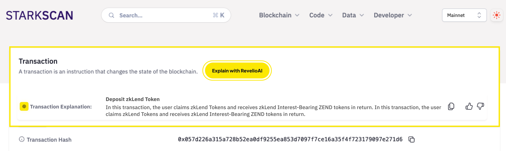
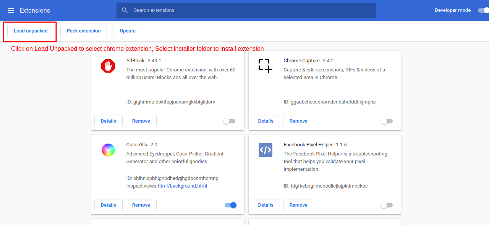
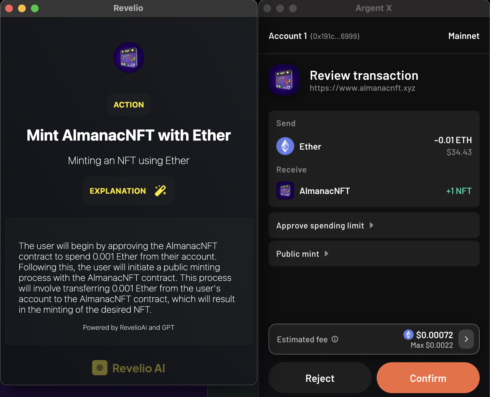

# Web3_AI Encode Hackathon Submission

## Project Title

Revelio AI: Explaining Transaction Data with AI on Starknet


Revelio Chrome Extension page: [Revelio Chrome Extension](https://chromewebstore.google.com/detail/revelio/fijkabbbpopdldafhjnpkhpeeegkohdm?authuser=0&hl=en)

## Introduction

Welcome to RevelioAI, the innovative extension that empowers Starknet users by transforming complex transaction data into easy-to-understand English sentences. Built with the power of AI, RevelioAI acts as a co-pilot, guiding users through the intricacies of Starknet transactions with clarity and simplicity.

Understanding transaction data can be a daunting task. RevelioAI addresses this challenge by analyzing raw transaction data and translating it into human-readable format. Whether you're a seasoned developer or a curious beginner, RevelioAI is designed to make your Starknet experience more accessible and comprehensible.

Our ambition is to change the way users interact with blockchain transactions. With RevelioAI, navigating Starknet has never been easier or more intruituve.

## Features

We leveraged on the following technologies we developed:

- **AI-Powered Interpretation**: Utilizes advanced AI algorithms to analyze and translate raw transaction data into understandable English sentences
- **Past Transaction Analysis**: Offers instant analysis of transaction data, ensuring users have the information they need at their fingertips.
- **Transaction Simulation Analysis:** Simulating transactions before they are sent onchain using nethermind API and explaining it to the user

## Our solutions

We decided to create the perfect co-pilot package for Starknet users to improve their experience and give them peace of mind when interacting with the Starknet ecosystem. Our goal was to create a product that not only allows users to know what they are signing before the transaction but also helps them understand what is happening after signing the transaction.

This dual approach led us to develop two complementary products: an interactive browser extension and a transaction explanation tool on block explorers. It is crucial for users to freely explore other aspects of the Starknet ecosystem on block explorers, as improving their overall visibility and understanding of all kinds of transactions will empower them to be more proactive in experimenting and using Starknet. Enhanced comprehension leads to increased confidence and willingness to engage more deeply with the ecosystem, ultimately leading to greater adoption and innovation within Starknet.

### **🌟 Transaction Explanations on Block Explorers**

**Description**: RevelioAI offers clear and comprehensive explanations for most transactions displayed on the Transaction Details page of Starknet Explorers. This feature provides a detailed overview of the main actions taken, making on-chain analysis more accessible and understandable.

**Benefits**: These explanations encompass the main actions taken and provide essential security-related information. This intelligent service, powered by GPT, serves as a valuable reference for on-chain analysis, providing insightful explanations for most transactions and enhancing the understanding of the Starknet ecosystem.

**How does it work**: By clicking the **Explain with RevelioAI** button, users can trigger the explanation of any transaction on Starknet. We also allow users to copy the explanation, as well as like or dislike it to provide feedback, which will help us continually improve the quality of our explanations.



### **🌟 Interactive Browser Extension for Real-Time Transaction Insights**

**Description**: The RevelioAI browser extension offers real-time explanations before users make a transaction on Starknet.

**Benefits**: Our extension offers a detailed breakdown of each transaction, including the specific actions being taken, the purpose behind the transaction, and an advanced explanation of what is going in and out of the user’s wallet. It also highlights the net transfers involved in the transaction, giving users a complete picture of what is happening. This ensures that users can make informed decisions with confidence, fully understanding each transaction before committing.

**How It Works**: Once the RevelioAI Browser Extension is installed, it automatically activates whenever a Starknet transaction is initiated. The extension seamlessly integrates with your wallet, popping up alongside it to provide a clear, human-readable version of the transaction. This ensures that users have all the essential information right at their fingertips, precisely when they need it.


## **Architecture and How it Works**

We have developed a browser extension that makes calls to several API endpoints deployed on AWS Lamba:

- **Transaction Simulation:** takes a transaction hash as input and creates an output similar to Nethermind Simulation output.
- **Transaction Decode:** takes the output of a transaction simulation and decodes the calldata and events into “contract_address”, “function”, “inputs” (name, type, value), “outputs” (name, type value).
- Transaction Human Readable: uses the information in our database that we scrapped from starkscan and voyager to give each contract address its name and image if available
- AI Explanation: uses a custom LLM based on GPT-3 to transform the json from the human readable version to a simple explanation. for example:

```jsx
{
    "title": "Transfer Standard Weighted Adalian Yield Tokens",
    "purpose": "Transfer of Standard Weighted Adalian Yield tokens with confirmation via Influence Dispatcher",
    "explanation": "This transaction will involve a transfer of 97,290,442,500 Standard Weighted Adalian Yield tokens from the user's account to the recipient account, followed by confirmations through the Influence Dispatcher contract. The user's account will be debited by 97,290,442,500 Standard Weighted Adalian Yield tokens.",
    "transfers": [
        {
            "token": "Standard Weighted Adalian Yield",
            "amount": "0",
            "from": "User's account",
            "to": "0x48242eca329a05af1909fa79cb1f9a4275ff89b987d405ec7de08f73b85588f"
        },
        {
            "token": "Standard Weighted Adalian Yield",
            "amount": "97,290,442,500",
            "from": "User's account",
            "to": "0x48242eca329a05af1909fa79cb1f9a4275ff89b987d405ec7de08f73b85588f"
        }
    ],
    "images": [
        "https://raw.githubusercontent.com/argentlabs/dappland/main/public/dapps/influence/WEG3UrcU_400x400.jpg",
        "https://raw.githubusercontent.com/argentlabs/dappland/main/public/dapps/influence/WEG3UrcU_400x400.jpg"
    ]
}
```

Please refer to the github repo [https://github.com/Revelioai/revelioai-api](https://github.com/Revelioai/revelioai-api) for the api implementation

## **Installation**

Get it from the chrome extension page [Revelio Chrome Extension](https://chromewebstore.google.com/detail/revelio/fijkabbbpopdldafhjnpkhpeeegkohdm?authuser=0&hl=en)
Or:
1. **Download** Revelio AI extension zip file [here](https://github.com/Revelioai/revelio-extension/releases)
2. **Open** your browser and navigate to Extensions
3. **Load** the extension into your Browser/Manage Extensions/Load unpacked



1. **Activate** the extension and pin to Chrome to have a better experience.
2. **Connect** your Starknet wallet.
3. **Use** RevelioAI to analyze your transaction

**Supported Websites & Dapps**

- Starkscan.com
- Voyager.online

## UI Example



## Technology Stack

- **Frontend**: React
- **Backend**: Node.js
- **AI**: Python, Hugginface, GPT
- **Blockchain**: Starknet

## Future Enhancements

- **Adaptive Learning System**: Implementing an adaptive learning system that continuously improves transaction explanations and suggestions based on user feedback and evolving transaction patterns.
- **Multilingual Support**: Adding support for multiple languages to cater to a broader audience.
- **Real-Time Collaboration Features**: Enabling real-time collaboration with AI assistance for multi-user transactions, where team members can collectively review, comment, and approve transactions with AI providing insights and summaries.

## Team

- Raouf Hecham: Data Engineer, AI Specialist
- Baptiste Florentin: Blockchain Expert
- Wafae Kerchi: OSINT , UX/UI Design

---

Thank you for considering RevelioAI for the Best Integration of AI in Transaction Simulation hackathon. We are excited to showcase how our solution can enhance the Starknet user experience by making transaction data more accessible and understandable.
